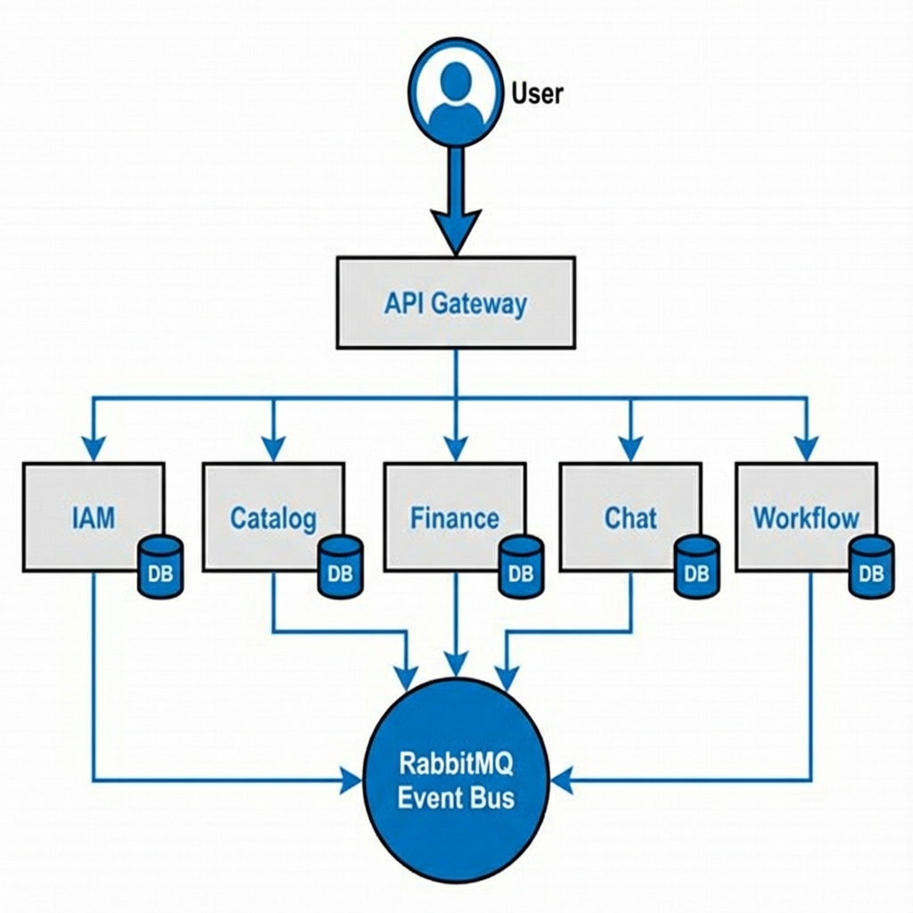

# ROOTPULSE Project Structure & Documentation

This document provides a detailed breakdown of the `ROOTPULSE-Backend` project structure, explaining both the **Technical** function and the **Business** value of each component.

## 1. Project Root Directories

### Current Directory Structure

```text
ROOTPULSE-Backend/
├── ci/                 # Continuous Integration scripts
├── deployment/         # Deployment configurations (Docker, K8s)
├── gateway/            # API Gateway logic
├── packages/           # Shared libraries
│   └── rootpulse-core/ # Core shared utilities and models
├── scripts/            # Project utility scripts
├── services/           # Microservices (Domain logic)
│   ├── catalog/        # Product inventory service
│   ├── chat/           # Chat & Messaging service
│   ├── finance/        # Financial transactions & wallets
│   ├── iam/            # Identity & Access Management (User/Auth)
│   ├── membership/     # Subscription & Tier management
│   ├── notifications/  # Notification dispatch service
│   └── workflow/       # Business process automation
├── venv/               # Python virtual environment
├── PROJECT_STRUCTURE.md # This documentation
└── ... (other root files)
```

### `services/`

The heart of the backend architecture. This project follows a **Microservices Architecture**, where each folder inside `services` represents a standalone, independently deployable service responsible for a specific domain of the application.

### `packages/`

Contains shared libraries and code blocks used across multiple services. This ensures consistency and reduces code duplication.

### `deployment/`

Contains configuration files for deploying the application (e.g., Docker, Kubernetes, or other orchestration tools).

- **Technical**: Manages how the code runs on servers.
- **Business**: Ensures the application is available, scalable, and resilient for users.

### `ci/` (Continuous Integration)

Contains scripts and configurations for automated testing and pipelines.

- **Technical**: Automates code quality checks and build processes.
- **Business**: Ensures that new features do not break existing functionality, maintaining a stable product.

### `scripts/`

Utility scripts for development, database management, or maintenance tasks.

---

## 2. High-Level Architecture Diagram

Here is a visual representation of how the **RootPulse** system components interact:



```mermaid
graph TD
    User[User / Client App] -->|HTTPS| Gateway[API Gateway (Nginx/Kong)]

    subgraph "Services Layer (Microservices)"
        Gateway -->|/auth| IAM[IAM Service]
        Gateway -->|/catalog| Catalog[Catalog Service]
        Gateway -->|/finance| Finance[Finance Service]
        Gateway -->|/chat| Chat[Chat Service]
        Gateway -->|/workflow| Workflow[Workflow Service]
    end

    subgraph "Infrastructure Layer"
        IAM & Catalog & Finance & Chat & Workflow <-->|Async Events| Bus((Event Bus / RabbitMQ))
        IAM --- DB_IAM[(IAM DB)]
        Catalog --- DB_Cat[(Catalog DB)]
        Finance --- DB_Fin[(Finance DB)]
        Chat --- DB_Chat[(Chat DB)]
        Workflow --- DB_WF[(Workflow DB)]
    end

    classDef service fill:#f9f,stroke:#333,stroke-width:2px;
    class IAM,Catalog,Finance,Chat,Workflow service;
```

## 3. Core Packages (`packages/`)

### `rootpulse-core`

**Technical**: A shared library containing common utilities, base models, database connectors, and messaging infrastructure (Bus) used by all microservices.
**Structure**:

- `bus/`: Handles async communication (e.g., RabbitMQ) between services.
- `models/`: Base database models to ensure consistent schema patterns.
- `observability/`: Logging, tracing, and metrics to monitor system health.
- `utils/`: Helper functions for dates, strings, parsing, etc.
  **Business**: Enforces standardization across the engineering team, speeding up development of new features and ensuring reliable system behavior.

---

## 3. Services (`services/`)

### `iam` (Identity and Access Management)

- **Technical**: Handles User Authentication (Login/Signup), Authorization (Permissions/Roles), and Token Management (JWT).
- **Business**: The security gatekeeper. It manages **User Accounts**, ensures only authorized personnel can access sensitive data, and handles onboarding (Registration).
- **Key Features**: User Profiles, Password Management, Security Policies.

### `catalog`

- **Technical**: Manages the database of items/products/services. Handles CRUD operations for catalog items.
- **Business**: The **Product/Service Inventory**. It allows the business to define what they are selling or offering. Use cases include listing products, categorizing them, and managing details like descriptions and pricing.

### `finance`

- **Technical**: Handles Transactions, Invoices, Payments, Wallets, and Ledger entries.
- **Business**: The financial backbone. It tracks **Revenue**, manages **Customer Payments**, handles **Billing**, and ensures financial compliance. It is crucial for monetization and financial reporting.

### `chat`

- **Technical**: Implements real-time messaging using WebSockets or polling. Manages chat history and conversation threads.
- **Business**: Facilitates **Communication**. This could be internal team collaboration, customer support chat, or user-to-user messaging. It drives engagement and support efficiency.

### `workflow`

- **Technical**: Manages state machines, process flows, and task tracking.
- **Business**: Automates **Business Processes**. It tracks the lifecycle of a request or task (e.g., Order Processing: Placed -> Approved -> Shipped). It ensures operational efficiency and visibility into process bottlenecks.

### `membership`

- **Technical**: Manages Subscription Plans, User Tiers, and Access Levels based on payments.
- **Business**: The **Monetization Engine** for subscription-based models. It handles upgrades, downgrades, and ensures users get the features they pay for (e.g., Free vs. Pro tier).

### `notifications` (Empty/Planned)

- **Technical**: (Planned) Centralized service for sending Emails, SMS, and Push Notifications.
- **Business**: (Planned) **User Engagement**. keeping users informed about activity, alerts, and marketing communications.

---

## 4. Other Key Files

- **`RootPuls - for developer.docx` / `RootPuls.xlsx`**: Project requirements and planning documents.
- **`RootPulse_workstep_dashboard.pdf`**: Visual documentation of workflows or UI mockups.
- **`dashboard_text.txt`**: Content related to dashboard display.

## Summary

The **ROOTPULSE** backend is structured to scale. By separating concerns into **IAM** (People), **Catalog** (Products), **Finance** (Money), **Chat** (Communication), and **Workflow** (Processes), the business can grow each area independently without creating a tangled mess of code. The `rootpulse-core` package binds them together with a common technical language.

---

## 5. Future Scalability & Polyglot Support (Java, C++, Go, etc.)

One of the key advantages of this **Microservices Architecture** is that you are not locked into a single programming language (currently Python). If future performance needs or team expertise require a service in **Java**, **C++**, **Go**, or others, it can be easily integrated.

### Integration Strategy: How it works

1.  **Containerization (Docker)**:

    - **Logic**: Every service runs in its own Docker container. Docker doesn't care what is inside (Python script, Java JAR, C++ binary). It just runs it.
    - **Implementation**: Create a `Dockerfile` for the new service that installs its specific runtime (e.g., JDK for Java) and runs its build process.

2.  **Communication Protocol (API - Synchronous)**:

    - **Logic**: Services talk to each other over HTTP/REST or gRPC.
    - **Implementation**: The new Java/C++ service just needs to expose standard HTTP endpoints (e.g., `GET /api/v1/resource`) or implement a gRPC server. The existing Python services will call it just like they call any other web API.

3.  **Event Bus (Messaging - Asynchronous)**:

    - **Logic**: Services share data updates via RabbitMQ (the Event Bus).
    - **Implementation**:
      - The new service will use a native client library (e.g., `amqp-client` for Java, `SimpleAmqpClient` for C++) to connect to the _same_ RabbitMQ instance.
      - It will publish and subscribe to messages using the same topic format (e.g., `rootpulse.orders.created`).
      - **Crucial Rule**: The message payload (JSON format) must match the structure expected by other services.

4.  **Database Isolation**:

    - **Logic**: Each microservice owns its own database.
    - **Implementation**: A new Java service can use `PostgreSQL`, `MongoDB`, or even `Oracle`, whatever fits best. It does not need to share a database connection with the Python services, preventing conflicts.

5.  **API Gateway**:
    - **Logic**: The Gateway is the single entry point for the frontend.
    - **Implementation**: You simply configure the Gateway (e.g., Nginx, Kong, or a custom Python gateway) to route traffic for a specific path (e.g., `/api/v1/heavy-computation/`) to the internal address of the new C++ service (e.g., `http://cpp-service:8080`).

### Summary of Steps for a New Language Service:

1.  **Create Folder**: `services/new-java-service/`.
2.  **Write Code**: Write the application in Java/C++.
3.  **Dockerize**: Add a `Dockerfile`.
4.  **Connect Bus**: Use a library to connect to the central RabbitMQ.
5.  **Route**: Update the Gateway config to point to this new container.
